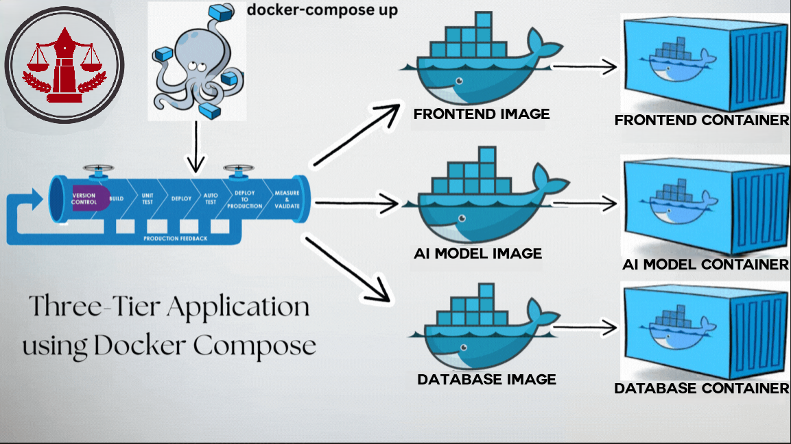

# Mouhami.tn – Legal Advice Platform 🇹🇳

> **📌 Note:** This repository does **not contain source code**.  
> Its primary purpose is to document and link to the project's **Docker container images** published on Docker Hub.  
> You can pull and run the full platform using the images listed below.


```markdown

````

---

**Mouhami.tn** is a Tunisian legal services platform that enables users to connect with certified lawyers, schedule consultations, ask legal questions, and generate law-related documents using AI.

This academic project was developed by a team of four students at the **Higher Institute of Computer Science – Ariana** (ISI Ariana) as part of our coursework. (Feb – May 2025).

---

## 📦 Docker Images

| Docker Image            | Description                      |
|-------------------------|----------------------------------|
| [`rowdox/mouhami`](https://hub.docker.com/r/rowdox/mouhami)       | PHP backend & logic            |
| [`rowdox/mouhamidb`](https://hub.docker.com/r/rowdox/mouhamidb)     | MongoDB database               |
| [`rowdox/trained-llama`](https://hub.docker.com/r/rowdox/trained-llama) | AI assistant model container   |

These containers make up the entire application and are intended to be orchestrated using Docker Compose.

---

## 🔍 Features

- 👥 **Role-based login** for clients and lawyers
- 📅 **Interview booking system**
- ⚖️ **Lawyer search by specialty**
- 🧾 **Legal information and assistance**
- 🤖 **AI assistant to help generate legal documents**

---

## 🛠️ Tech Stack

- **Frontend**: HTML, CSS, JavaScript (custom UI)
- **Backend**: PHP
- **Database**: MongoDB
- **AI**: Fine-tuned LLaMA model (trained on legal document datasets)
- **Deployment**: Docker & Docker Compose
- **Server**: the project was deployed on a hardened Ubuntu with UFW, user isolation, and configured access

---

## 📐 Architecture

The application follows a **three-container architecture**, each isolated and orchestrated using Docker Compose:

- 🎨 `frontend`: Static UI served with logic in PHP  
- 🧠 `trained-llama`: AI service for Q&A and legal doc generation  
- 🗃️ `mouhamidb`: MongoDB for persistent storage


---

## 🎓 Academic Context

- 📚 **Class**: Academic Group Project – Projet Fédérée
- 🏫 **University**: Higher Institute of Computer Science – Ariana (ISI Ariana)  
- 🧑‍🤝‍🧑 **Team**: 4 members  
- ⏳ **Duration**: February – May 2025  
- 🧑‍💼 **Role**: Team lead, Dockerization & system provisioning


---

## 📎 License

This project is for **educational and demonstration purposes only**.
It does not contain real data and is not intended for production use.
